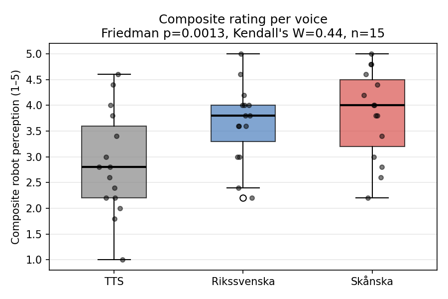
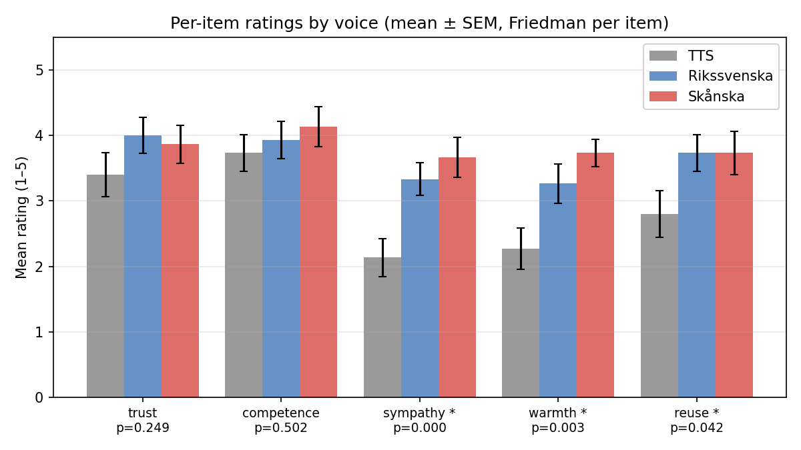
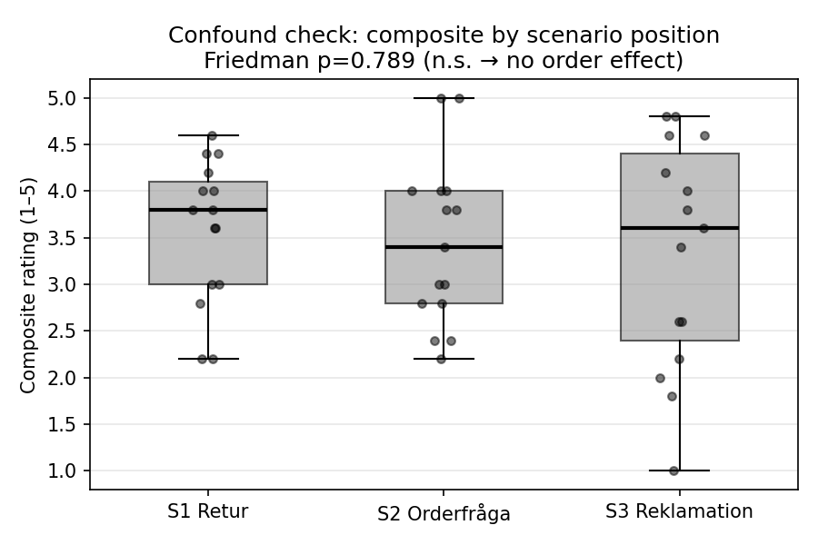
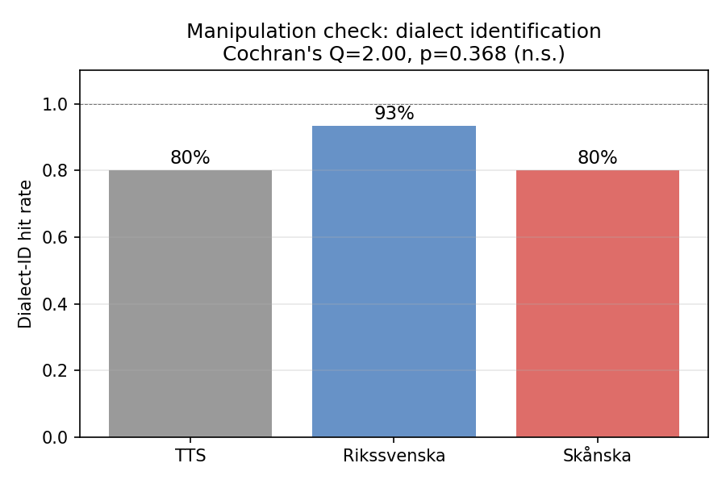

# Statistical analysis — voice condition on robot perception

Beginner-friendly walkthrough of the four result plots in `plots/`. Reading time ~10 min.

## Study setup in one paragraph

15 participants (P01–P15) each spoke with a Furhat robot in **three customer-service scenarios** (return, order question, complaint). The robot used a different **voice** in each scenario: synthetic TTS, recorded standard Swedish (Rikssvenska), or recorded Skåne dialect (Skånska). After each scenario participants rated the robot on **five Likert items** (trust, competence, sympathy, warmth, willingness to reuse), scale 1–5. The scenario order was fixed (S1→S2→S3); only the voice rotated across participants, balanced so each voice appeared equally often in each scenario position. Question: do voices produce different ratings, and is that difference real or noise?

## Glossary first

| Term | Plain English |
|---|---|
| **Likert item** | A 1–5 rating question ("how trustworthy did you find the robot?"). |
| **Composite** | Mean of the five items per participant per voice. Reduces five numbers to one. |
| **Median** | The middle value when sorted. Half the people scored higher, half lower. Less swayed by outliers than the mean. |
| **IQR (interquartile range)** | Range covering the middle 50% of people. |
| **Within-subjects** | Each participant tries every condition. Lets us compare a person to themselves. |
| **Friedman test** | "Are these 3 within-subjects conditions truly different, or could the differences be random?" Gives a p-value. |
| **Wilcoxon signed-rank** | Same question but for **two** paired conditions. Used to follow up Friedman. |
| **Cochran's Q** | Friedman's cousin for **yes/no** outcomes (e.g. "did the participant correctly identify the voice?"). |
| **p-value** | If voices were truly equal, the probability we'd see results this extreme by chance. Smaller = stronger evidence of a real difference. Convention: p < .05 = "significant". |
| **Kendall's W** | Effect size for Friedman. 0 = no effect, 1 = perfect agreement. .1 small, .3 medium, .5 large. |
| **r (Wilcoxon)** | Effect size for the pairwise test. Same scale labels as Kendall's W. |
| **Bonferroni correction** | When running several tests, shrink the "significance" cutoff to avoid false positives. With three tests, α=.05/3 = .017. |
| **Cronbach's α** | "Do these 5 items measure the same underlying thing?" α ≥ .7 = yes, safe to average them. We got .85. |

## Plot 1 — Composite rating per voice



### What it shows
Each box summarises the 15 participants' composite scores (average of their 5 Likert ratings) for one voice. Dots are the individual participants, jittered horizontally so they don't overlap.

### How to read a boxplot
- **Black horizontal bar** inside the box = the **median** score.
- **Box** itself = the middle 50% of participants (the IQR). Tall box → wide spread of opinions. Short box → people agreed.
- **Whiskers** = the rest of the data within reasonable range.
- **Open circle** below the Rikssvenska whisker = an **outlier** — one participant whose score sat far from the rest.

### What this plot says
- **TTS** sits low: median 2.8, big spread from 1.0 to 4.6. People disliked the synthetic voice on average, but a few tolerated it.
- **Rikssvenska** and **Skånska** both sit high: medians 3.8 and 4.0. Boxes overlap heavily — these two voices look interchangeable.
- The gap is between **synthetic vs human-recorded**, not between the two human accents.

### What the title stats mean
- `Friedman p = 0.0013` → if all three voices were truly rated the same, we'd see a pattern this strong only 0.13% of the time by chance. Very unlikely. **There is a real difference somewhere.**
- `Kendall's W = 0.44` → the effect size is **large**. People consistently ranked one voice differently from another.
- `n = 15` → number of participants. Friedman uses each person three times (once per voice).

### Why are some dots at non-integer heights (e.g. 3.4)?
The composite is the **mean of five 1–5 items**. The mean of five integers can only land on multiples of 0.2 (a number divided by 5). So dots fall on a grid: 1.0, 1.2, 1.4 … 5.0. Twenty-one possible heights, which makes the boxplot look continuous.

### Caveat
Friedman alone only tells us *some* voice differs. It doesn't say *which two*. Plot 2 and the pairwise post-hoc tests do.

## Plot 2 — Per-item ratings by voice



### What it shows
The composite hides which of the five Likert items drives the overall voice effect. This plot **breaks the composite apart**.

- **X-axis**: the five items (trust, competence, sympathy, warmth, reuse).
- **Y-axis**: average rating across the 15 participants.
- **Three bars per item**: one per voice (TTS grey, Rikssvenska blue, Skånska red).
- **Vertical black line on each bar (error bar)**: the **SEM** (standard error of the mean) — a rough indicator of how much the average would wobble if we ran the study again. Short bar = stable average. Long bar = noisy.
- **Star (\*) under an item label**: the per-item Friedman test was significant for that dimension (p < .05).

### How to read it
For each item, ask: "do the three bars look clearly different in height, beyond what the error bars suggest?"

- **trust**: bars roughly equal heights ≈ 4.0. Wobble within error bars. p = .25, no star → people trusted all three voices about the same.
- **competence**: same story, ≈ 4.0. p = .50 → no difference.
- **sympathy**: TTS sits much lower than the two human voices. Stars confirm: p = .0003, large effect (W = .54).
- **warmth**: same shape — TTS clearly below. p = .003, W = .38.
- **reuse**: TTS lower again, smaller gap. p = .04, marginal.

### What this means in plain English
Participants thought TTS was **just as trustworthy and competent** as the human voices. What TTS lost on was the **warm/likeable/want-to-meet-again** axis. The synthetic voice felt cold, not incompetent.

### Caveat
Per-item tests are **exploratory** — we ran five of them. With α=.05 each, on average 0.25 false positives per study. So a single .04 is weak evidence; the .0003 sympathy result is strong.

## Plot 3 — Confound check: composite by scenario position



### Why we need this plot
Scenarios were always run in the same order (S1 Retur → S2 Orderfråga → S3 Reklamation). If participants got bored, warmed up, or rated the last robot harshly, that order effect would **fake** a voice difference — because some voices appeared in S1 more often than others (no — counterbalanced) or because the scenario content itself biased ratings.

This plot asks: **ignoring voice, do ratings depend on scenario position?**

### How to read it
Same boxplot conventions as Plot 1. Three boxes, one per scenario position.

- All three boxes overlap massively.
- Medians: S1 = 3.8, S2 = 3.4, S3 = 3.6. Tiny differences.

### What the title stats mean
- `Friedman p = 0.789` → far above .05. We cannot detect any position effect. No evidence that "first scenario gets rated highest" or "people fatigue by S3".
- "(n.s.)" = **not significant**. The data is consistent with "no order effect at all".

### What this means for our voice conclusion
The voice effect in Plot 1 is **not contaminated** by scenario order. If we'd seen a strong position effect here, the headline finding would be ambiguous: is TTS lower because it's TTS, or because TTS happened to be in a worse scenario position? Plot 3 rules that out.

### Caveat
"Not significant" with n=15 doesn't mean "definitely zero effect" — only that any order bias is too small for us to detect. Good enough for a course study.

## Plot 4 — Manipulation check: dialect identification



### What it shows
After each scenario, participants were asked **what dialect they thought the robot had** (free choice from a list). This plot shows the **hit rate** — the fraction of participants who labelled each voice correctly.

- TTS hit = participant said "Syntetisk/TTS-röst".
- Skånska hit = participant said "Skånsk".
- Rikssvenska hit = participant said "Rikssvenska", "Stockholmsdialekt", or "Ingen specifik dialekt" (counted as correct because standard Swedish is supposed to be the unmarked, neutral baseline — confusing it with "no dialect" is the *intended* perception).

### How to read it
Plain bar chart of hit rates. Percentages above each bar.

- Rikssvenska: **93%** correctly identified.
- Skånska: **80%**.
- TTS: **80%**.

### What the title stats mean
- `Cochran's Q = 2.0, p = 0.37` → no significant difference between the three hit rates. Statistically, all three voices were identified about equally well.

### Why this plot matters: manipulation check
A "manipulation check" asks: **did our experimental treatment actually work?** If participants couldn't tell our voices apart, the rating differences in Plot 1 would mean nothing — you can't have a "dialect effect" if nobody noticed the dialect.

- 80%+ accuracy across the board says the voice manipulation **worked**: participants heard what we played.
- Cochran's Q n.s. says **no voice was harder to identify than another** — the rating differences in Plot 1 aren't an artefact of "people couldn't hear Skånska so they rated it weirdly".

### Caveat
80% is good but not perfect. 3 of 15 participants mis-labelled TTS and Skånska. A bigger study would want to know if mis-identifiers rate differently from correct identifiers. n=15 too small to split.

## Putting it together

1. **Voice matters** (Plot 1): synthetic TTS rated lower than either human-recorded voice.
2. **The two human voices are equivalent** (Plot 1): standard Swedish and Skåne dialect produced indistinguishable scores. The study found no evidence that dialect harms (or helps) robot perception in this customer-service context.
3. **The TTS deficit is socio-affective, not cognitive** (Plot 2): participants thought TTS was equally trustworthy and competent — they just didn't find it warm or likeable.
4. **The finding is not an order artefact** (Plot 3): no scenario-position effect.
5. **The manipulation worked** (Plot 4): participants reliably identified the voices, so the rating gap reflects voice perception, not confusion.

## Limitations honest box

- **n = 15** is tiny. We only detected the effects because they were large. Smaller effects (e.g. subtle dialect biases) would be invisible.
- **Composite hides nuance.** Trust ≈ Competence ≈ flat across voices is interesting and only visible because we ran per-item tests as well.
- **No Skåne-region participants** in the sample. The "Skåningar prefer Skånska" hypothesis can't be tested here.
- **Likert items are ordinal**, not continuous. We respected that by using non-parametric tests throughout (Friedman, Wilcoxon, Cochran), not t-tests or ANOVA.
- **Multiple tests run** — per-item results are exploratory. Don't read too much into a single p ≈ .04.

## Where the numbers live

- Code: [`analysis.py`](analysis.py)
- Plots: [`plots/`](plots/)
- Raw responses: [`responses_raw_v2 - Formulärsvar 1.csv`](responses_raw_v2%20-%20Formul%C3%A4rsvar%201.csv)

Re-run any time with:

```bash
.venv/bin/python analysis.py
```
